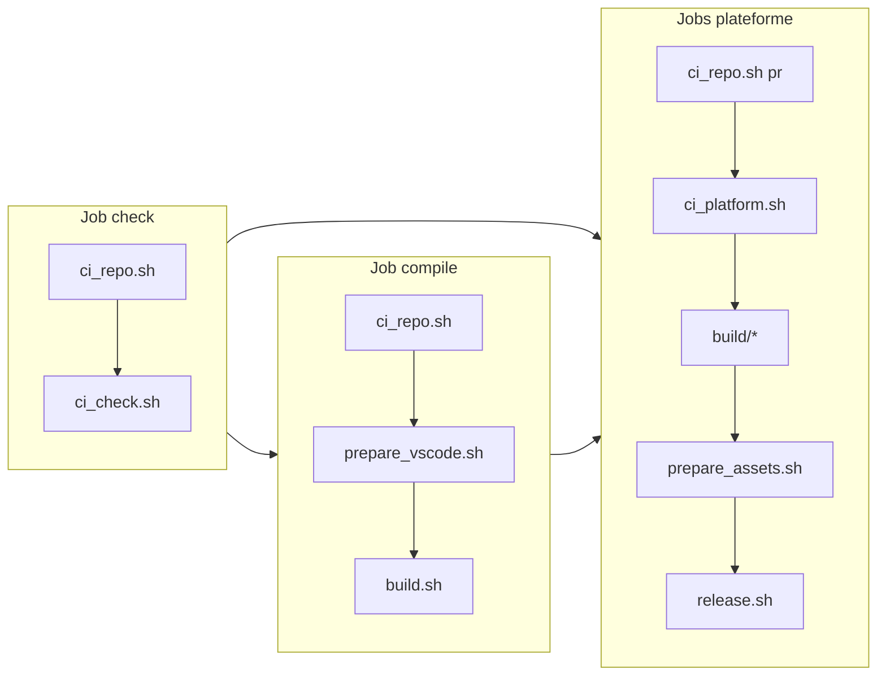

# Scripts du pipeline Void Builder

Scripts hérités de VSCodium. **Points d’entrée** à la racine ; **bibliothèques et helpers** dans `scripts/`.

## Arborescence

```
./                          # points d’entrée CI (workflows ./script.sh)
├── ci_repo.sh
├── ci_check.sh
├── ci_platform.sh
├── prepare_vscode.sh
├── build.sh
├── prepare_assets.sh
├── release.sh
└── update_version.sh

scripts/
├── lib/                    # sourcés uniquement (ne pas lancer)
│   ├── utils.sh            # apply_patch, ensure_build_sourceversion, VOID_BUILDER_ROOT
│   └── ci_lib.sh           # cron/PR, bump, gh, flags build
├── update_settings.sh      # appelé depuis prepare_vscode (cwd vscode/)
├── undo_telemetry.sh
├── build_cli.sh
├── prepare_src.sh          # utilitaire checksum (hors CI)
└── update_upstream.sh      # maintenance manuelle
```

## Pipeline CI (`stable`)



## Points d’entrée (racine)

| Script | Rôle |
|--------|------|
| [`ci_repo.sh`](../ci_repo.sh) | Checkout PR + clone Void (`pr` \| `void` \| `all`) |
| [`ci_check.sh`](../ci_check.sh) | Job **check** |
| [`ci_platform.sh`](../ci_platform.sh) | `gh` + flags `SHOULD_BUILD_*` |
| [`prepare_vscode.sh`](../prepare_vscode.sh) | Patches + config |
| [`build.sh`](../build.sh) | Compilation |
| [`prepare_assets.sh`](../prepare_assets.sh) | Binaires + checksums |
| [`release.sh`](../release.sh) | Release GitHub |
| [`update_version.sh`](../update_version.sh) | JSON auto-update |

## `scripts/` (non exécutés par les workflows directement)

| Script | Rôle |
|--------|------|
| [`scripts/lib/utils.sh`](../scripts/lib/utils.sh) | Fonctions partagées |
| [`scripts/lib/ci_lib.sh`](../scripts/lib/ci_lib.sh) | Logique CI sourcée par `ci_check` / `ci_platform` |
| [`scripts/update_settings.sh`](../scripts/update_settings.sh) | Réglages télémétrie dans `vscode/` |
| [`scripts/undo_telemetry.sh`](../scripts/undo_telemetry.sh) | URLs Microsoft → 0.0.0.0 |
| [`scripts/build_cli.sh`](../scripts/build_cli.sh) | Build du CLI Rust |

Variable **`VOID_BUILDER_ROOT`** : définie automatiquement par `scripts/lib/utils.sh` (chemin racine du dépôt).

## Plateforme & dev

| Dossier | Usage |
|---------|--------|
| `build/linux/`, `build/windows/`, … | Packaging par OS |
| `dev/` | `./dev/build.sh` → `ci_repo.sh void` + `scripts/lib/utils.sh` |
| `patches/helper/` | Helpers post-patch |

## Variables d’environnement

| Variable | Définie par | Sens |
|----------|-------------|------|
| `RELEASE_VERSION` | `ci_repo.sh` / bump | Tag release |
| `VOID_BUILDER_ROOT` | `scripts/lib/utils.sh` | Racine du repo builder |
| `SHOULD_BUILD` | `ci_check` | Lancer la compilation |
| `SKIP_GH_INSTALL` | workflow | Pas d’install `gh` si pas de deploy |
